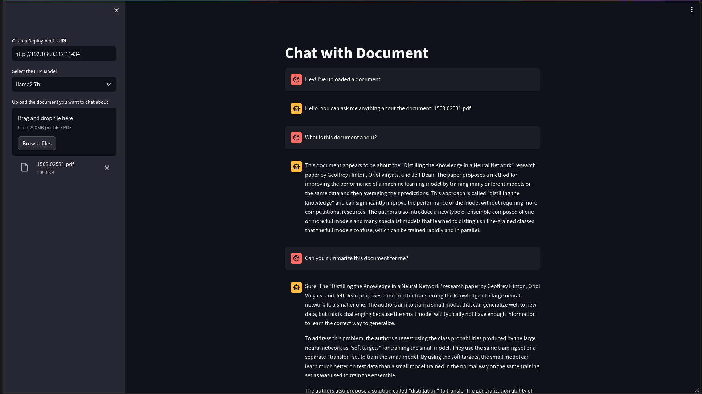

# Chat with Document
A Web application that enables users to upload documents and engage in conversational analysis with self-hosted large
language models (LLMs) deployed on [Ollama](https://www.avni.sh/posts/homelab/self-hosting-ollama/), facilitating document understanding and interactive querying.

# Screenshot


# Tech Stack
* Python
* Streamlit
* LangChain
* Ollama

# Setup
1. Clone this repository.
```bash
git clone https://github.com/bovem/chat-with-doc.git
```

2. Build the container image.
```bash
docker compose build
```

3. (Optional) Update the value of `OLLAMA_URL` (Ollama deployment URL) environment variable in [compose.yaml]().

4. Deploy the container.
```bash
docker compose up
```
